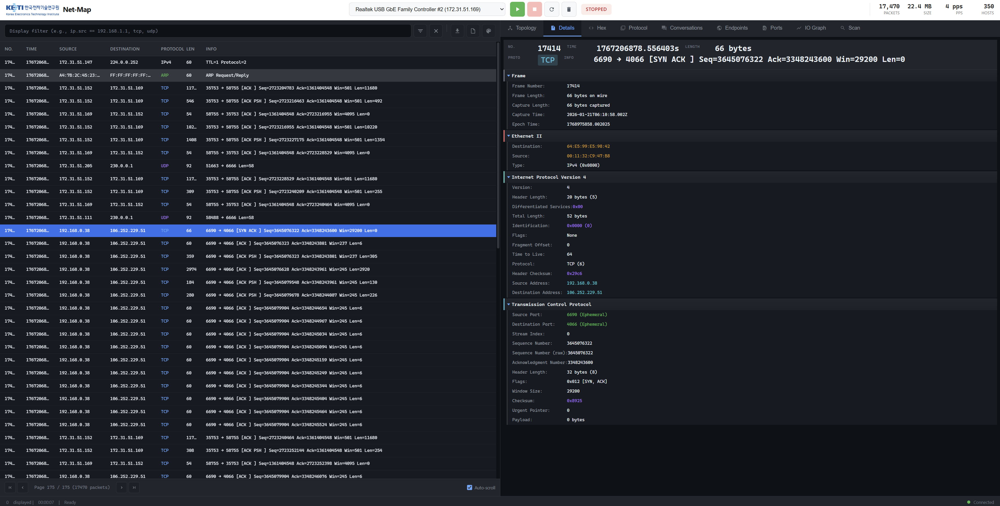

# Net-Map

<div align="center">


**Cross-platform Network Packet Analyzer with Real-time Web UI**

[](LICENSE)
[]()
[]()
[-orange.svg)]()
[](https://npcap.com/)

[Features](#features) • [Installation](#installation) • [Usage](#usage) • [Screenshots](#screenshots) • [API](#api-reference)

</div>

---

## Overview

Net-Map is a lightweight, high-performance network packet analyzer built in C. It provides a modern Wireshark-style web interface for real-time packet capture, protocol analysis, and network visualization.

## Features

### Packet Capture & Analysis

| Feature | Description |
|---------|-------------|
| **Real-time Capture** | Live packet capture using libpcap/Npcap with minimal latency |
| **BPF Filters** | Berkeley Packet Filter support for efficient traffic filtering |
| **Protocol Parsing** | Deep packet inspection for multiple protocol layers |
| **Cross-platform** | Native support for Windows (Npcap) and Linux (libpcap) |

#### Supported Protocols

| Layer | Protocols |
|-------|-----------|
| **Layer 2** | Ethernet, ARP |
| **Layer 3** | IPv4, ICMP |
| **Layer 4** | TCP, UDP |
| **Layer 7** | DNS, HTTP, HTTPS/TLS |

### Web UI Features

#### Packet List View
- Sortable columns (No, Time, Source, Destination, Protocol, Length, Info)
- Protocol-based row coloring (TCP=blue, UDP=green, ICMP=yellow, ARP=gray)
- Real-time packet streaming with auto-scroll
- Display filter with live filtering
- Pagination for large captures

#### Packet Details View
- Expandable tree structure for each protocol layer
- Wireshark-style layer headers with color coding
- Syntax highlighting for IP addresses, ports, flags
- Copy values to clipboard

#### Hex Dump View
- Traditional hex/ASCII dump display
- Offset | Hex bytes | ASCII representation
- Byte highlighting on hover

### Statistics & Charts

| Tab | Visualization | Data |
|-----|---------------|------|
| **Protocol** | Pie Chart | Protocol distribution by packets/bytes |
| **Endpoints** | Bar Chart | Top hosts by Tx/Rx traffic |
| **Ports** | Bar Chart | Top ports by packet count |
| **Conversations** | Table | Connection pairs with duration |
| **IO Graph** | Line Chart | Time-series traffic visualization |

#### IO Graph Options
- Interval: 1ms, 10ms, 50ms, 100ms, 500ms, 1s, 10s
- Y-Axis: Packets, Bytes, Bits/s
- Filter: Protocol-based filtering
- Smooth: Moving average smoothing

### Network Topology

Interactive force-directed graph visualization using D3.js:

| Node Type | Color | Description |
|-----------|-------|-------------|
| **Local** | Blue | Devices on local subnet |
| **Gateway** | Orange | Default gateway/router |
| **Remote** | Green | External IP addresses |
| **Broadcast** | Purple | Broadcast/multicast addresses |

Features:
- Drag nodes to reposition
- Zoom and pan navigation
- Search by IP address
- Click for node details (packets, bytes, first/last seen)
- Filter packets by selected node

### Network Scanner

| Scan Type | Method | Use Case |
|-----------|--------|----------|
| **ARP Scan** | ARP Request/Reply | Local network host discovery |
| **Ping Scan** | ICMP Echo | Host availability check |
| **TCP SYN** | Half-open scan | Port scanning (coming soon) |

Scanner Features:
- CIDR notation support (e.g., 192.168.1.0/24)
- Progress tracking with ETA
- Results in table or grid view
- Export discovered hosts

### Packet Generator

Generate test packets for debugging and testing:

| Option | Description |
|--------|-------------|
| **Protocol** | TCP, UDP, or ICMP |
| **Count** | Number of packets to generate (1-10000) |
| **Payload Size** | Custom payload size (0-1400 bytes) |
| **Random IPs** | Generate random source/destination IPs |
| **Fixed IPs** | Specify exact IP addresses and ports |

---

## Installation

### Prerequisites

#### Windows
1. **Npcap** - https://npcap.com/
   - Install with "WinPcap API-compatible Mode" checked
   - For WiFi capture, also check "Support raw 802.11 traffic"
2. **Npcap SDK** - https://npcap.com/#download
   - Extract to `C:\npcap-sdk` (or update path in CMakeLists.txt)
3. **MSYS2/MinGW-w64** - https://www.msys2.org/
   ```bash
   # In MSYS2 terminal:
   pacman -S mingw-w64-x86_64-cmake mingw-w64-x86_64-ninja mingw-w64-x86_64-gcc
   ```

#### Linux
```bash
sudo apt install libpcap-dev cmake ninja-build build-essential
```

### Build from Source

#### Quick Build (Recommended)

**Windows (CMD or PowerShell):**
```cmd
build.bat
```

**Linux:**
```bash
chmod +x build.sh
./build.sh
```

#### Manual Build

```bash
# Clone
git clone https://github.com/hwkim3330/net-map.git
cd net-map

# Configure
cmake -B build -G Ninja

# Build
cmake --build build

# Output: build/bin/net-map (or net-map.exe on Windows)
```

### Troubleshooting

| Issue | Solution |
|-------|----------|
| `Permission denied` when building | Close running net-map.exe first |
| `wpcap.h not found` | Set correct Npcap SDK path in CMakeLists.txt |
| WiFi interfaces not listed | Enable npcap_wifi service (Admin PowerShell): `sc config npcap_wifi start= demand && sc start npcap_wifi` |
| `cmake not found` | Add MinGW bin to PATH or use full path |

---

## Usage

### Command Line Options

```
net-map [options]

Options:
  -i <interface>    Network interface to capture on
  -p <port>         Web server port (default: 8080)
  -f <filter>       BPF filter expression
  -l                List available interfaces
  -h                Show help

Examples:
  net-map -l                         # List interfaces
  net-map -i eth0                    # Capture on eth0
  net-map -i eth0 -f "tcp port 80"   # HTTP traffic only
  net-map -i eth0 -p 9090            # Custom web port
```

### Windows

```powershell
# Run as Administrator
.\build\bin\net-map.exe -l
.\build\bin\net-map.exe -i "\Device\NPF_{GUID}"
```

### Linux

```bash
# Requires root for packet capture
sudo ./build/bin/net-map -i eth0
```

### Access Web UI

Open **http://localhost:8080** in your browser.

---

## Screenshots

### Main Interface - Packet Capture

*Real-time packet capture with protocol coloring, filtering, and detailed packet inspection*

### Statistics & Visualization

*Protocol distribution charts, endpoint analysis, and network topology visualization*

---

## API Reference

### Endpoints

| Endpoint | Method | Description |
|----------|--------|-------------|
| `/api/status` | GET | Capture status, packet count, bytes |
| `/api/packets` | GET | Fetch packets (supports `since_id`, `limit`) |
| `/api/interfaces` | GET | List available network interfaces |
| `/api/filter` | POST | Set BPF capture filter |
| `/api/control` | POST | Control capture (start/stop/clear) |

### Scanner API

| Endpoint | Method | Description |
|----------|--------|-------------|
| `/api/scan/start` | POST | Start network scan |
| `/api/scan/stop` | POST | Stop running scan |
| `/api/scan/status` | GET | Get scan progress |
| `/api/scan/results` | GET | Get discovered hosts |

### Generator API

| Endpoint | Method | Description |
|----------|--------|-------------|
| `/api/generate` | POST | Generate test packets |

### Example API Calls

```bash
# Get status
curl http://localhost:8080/api/status

# Get packets since ID 100
curl "http://localhost:8080/api/packets?since_id=100&limit=50"

# Set filter
curl -X POST -d "filter=tcp port 443" http://localhost:8080/api/filter

# Start capture
curl -X POST -d "action=start" http://localhost:8080/api/control

# Start ARP scan
curl -X POST -d "type=arp&target=192.168.1.0/24" http://localhost:8080/api/scan/start

# Generate test packets
curl -X POST -H "Content-Type: application/json" \
  -d '{"count": 100, "type": "TCP", "random": true}' \
  http://localhost:8080/api/generate
```

---

## Project Structure

```
net-map/
├── src/
│   ├── core/                 # Core functionality
│   │   ├── capture.c         # Packet capture (libpcap)
│   │   ├── parser.c          # Protocol dissection
│   │   ├── buffer.c          # Ring buffer storage
│   │   └── scanner.c         # Network scanner
│   ├── platform/             # OS-specific code
│   │   ├── windows.c
│   │   └── linux.c
│   ├── web/                  # Web server
│   │   ├── server.c          # Mongoose HTTP server
│   │   ├── api.c             # REST API handlers
│   │   ├── websocket.c       # Real-time updates
│   │   └── static/           # Frontend files
│   │       ├── index.html
│   │       ├── app.js
│   │       └── style.css
│   └── main.c
├── include/                  # Headers
├── lib/                      # Third-party
│   ├── mongoose/             # Web server
│   └── cJSON/                # JSON library
├── CMakeLists.txt
└── README.md
```

---

## Dependencies

| Library | Purpose | License |
|---------|---------|---------|
| [libpcap](https://www.tcpdump.org/) / [Npcap](https://npcap.com/) | Packet capture | BSD / Npcap License |
| [Mongoose](https://mongoose.ws/) | Embedded web server | MIT |
| [cJSON](https://github.com/DaveGamble/cJSON) | JSON parsing | MIT |
| [D3.js](https://d3js.org/) | Topology visualization | ISC |
| [Chart.js](https://www.chartjs.org/) | Statistics charts | MIT |

---

## Keyboard Shortcuts

| Key | Action |
|-----|--------|
| `Ctrl+E` | Toggle capture |
| `F5` | Start capture |
| `F6` | Stop capture |
| `Ctrl+S` | Save PCAP |
| `Ctrl+F` | Focus filter input |
| `Ctrl+Up/Down` | Navigate packets |
| `Ctrl++/-` | Zoom in/out |
| `F11` | Toggle fullscreen |
| `Escape` | Clear selection / Close modal |

---

## Contributing

1. Fork the repository
2. Create a feature branch (`git checkout -b feature/new-feature`)
3. Commit your changes (`git commit -m 'Add new feature'`)
4. Push to the branch (`git push origin feature/new-feature`)
5. Open a Pull Request

---

## License

This project is licensed under the MIT License - see the [LICENSE](LICENSE) file for details.

---

## Author

**hwkim3330** - [GitHub](https://github.com/hwkim3330)

---

<div align="center">

*Built with C, libpcap, and modern web technologies*

</div>
